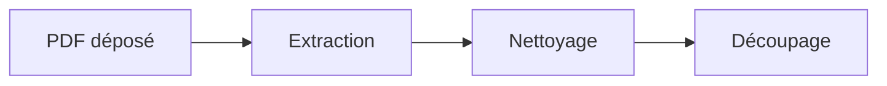
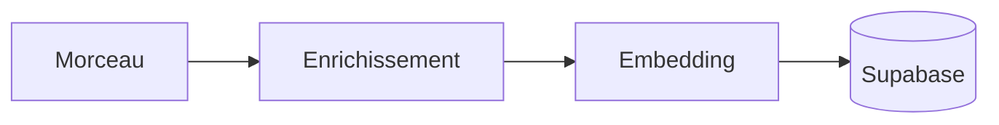
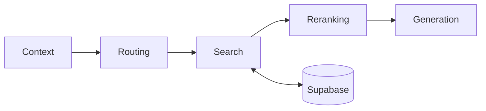

<p align="center">
  
</p>

<h1 align="center">Chat Botté</h1>

<p align="center">
  Un chatbot qui répond aux questions sur un PDF, en citant les pages.<br>
  RAG construit avec n8n, Supabase et Gemini.
</p>

<p align="center">
  <a href="https://rlescao-creator.github.io/n8n-rag-workflows/"><b>Essayer le chatbot</b></a>
</p>

---

## En bref

| | |
|---|---|
| **Ce que ça fait** | On dépose un PDF. On pose ensuite des questions en langage naturel. Le bot répond à partir du document seulement, avec les numéros de page. |
| **Comment** | Un workflow n8n découpe et vectorise le PDF, puis retrouve et trie les passages utiles à chaque question. |
| **Où ça tourne** | Le workflow sur n8n Cloud, les données sur Supabase, la page du chatbot sur GitHub Pages. |

## Sommaire

- [Le principe du RAG](#le-principe-du-rag)
- [Ingestion : préparer le document](#ingestion--préparer-le-document)
- [Réponse : traiter une question](#réponse--traiter-une-question)
- [Technologies](#technologies)
- [Structure du dépôt](#structure-du-dépôt)
- [Installation](#installation)
- [Résultats mesurés](#résultats-mesurés)
- [Limites connues](#limites-connues)
- [Skills](#skills)

## Le principe du RAG

Un modèle de langage ne connaît pas vos documents. Si on l'interroge dessus, il invente.

Le RAG (*Retrieval-Augmented Generation*) règle ce problème en deux temps :

1. **Ingestion**, une fois par document : on le découpe en morceaux et on transforme chaque
   morceau en vecteur, pour pouvoir chercher par le sens.
2. **Réponse**, à chaque question : on retrouve les morceaux les plus pertinents et on les
   donne au modèle, qui rédige à partir d'eux.

Le workflow n8n contient ces deux parties.

## Ingestion : préparer le document

**Branche principale**, une fois par document :



**Branche de stockage**, une fois par morceau :



| Étape | Nœud n8n | Rôle |
|---|---|---|
| Dépôt | `Upload Document` | Formulaire web qui reçoit le PDF. |
| Extraction | `Extract PDF Text` | Sort le texte, page par page. |
| Nettoyage | `Clean Text` | Retire les caractères parasites et les numéros de page, puis recolle le tout en un texte continu. |
| Découpage | `Recursive Rolling Chunks` | Coupe aux endroits naturels (paragraphe, phrase, mot), puis fait glisser une fenêtre avec environ 200 caractères de recouvrement. Vise un morceau par page. |
| Distribution | `Embed One Chunk` | Appelle la branche de stockage une fois par morceau. |
| Enrichissement | `Enrich Chunk` | Gemini ajoute à chaque morceau un contexte, trois questions possibles, des mots-clés, des entités et des relations. |
| Assemblage | `Build Enriched Chunks` | Construit le texte à vectoriser : contexte, passage, questions, mots-clés. |
| Stockage | `Store Chunk in Supabase` | Calcule le vecteur et enregistre le morceau avec ses métadonnées. |

**Pourquoi enrichir ?** Un morceau isolé perd son contexte. Les questions hypothétiques
rapprochent le vocabulaire du document de celui des utilisateurs.

## Réponse : traiter une question



| Étape | Nœuds n8n | Rôle |
|---|---|---|
| **Context** | `Inputs`, `Get Session Messages`, `Empty Conversation`, `Format History`, `Load Document Catalog` | Rassemble la question, la config, l'historique de la session et la liste des documents. |
| **Routing** | `Route Question`, `Build Search Queries` | Gemini reformule la question en une question autonome, trois requêtes de recherche, des mots-clés et des filtres. |
| **Search** | `Vector Search`, `Keyword Search`, `Merge Search Results` | Recherche par le sens (vecteurs) et par les mots (plein texte Postgres), puis fusion des deux listes. 20 candidats. |
| **Reranking** | `Rerank Passages`, `Select Top Passages` | Gemini note chaque candidat de 0 à 10. Les 5 meilleurs sont gardés. |
| **Generation** | `Write Answer`, `Save Conversation`, `Reply` | Gemini rédige à partir de ces passages seulement, cite les pages, puis l'échange est enregistré. |

**Pourquoi deux recherches ?** Les vecteurs captent le sens, les mots-clés captent les termes
exacts. Les deux se complètent.

**Pourquoi reranker ?** La recherche est rapide mais approximative. On ratisse large, puis on
trie finement.

**Et si un appel au modèle échoue ?** Le routage et le reranking ont un repli : le workflow
continue avec la question d'origine et l'ordre de la recherche.

## Technologies

| Brique | Outil |
|---|---|
| Orchestration | [n8n](https://n8n.io) Cloud |
| Workflow en code | [`n8ncli`](https://www.npmjs.com/package/@workflows-accelerator/n8n-cli), fichiers TypeScript |
| Base vectorielle | Supabase (Postgres avec pgvector) |
| Embeddings | Gemini `gemini-embedding-001`, 3072 dimensions |
| Modèles | Gemini Flash Lite |
| Interface | Page HTML statique, sans dépendance, sur GitHub Pages |

## Structure du dépôt

```
.
├── docs/                    La page du chatbot (GitHub Pages)
│   ├── index.html
│   └── avatar.jpg
├── n8n/workflows/           Le workflow, en TypeScript
│   └── Insiders Dossier RAG.workflow.ts
├── supabase/
│   └── schema.sql           Les tables et la fonction de recherche
├── specs/
│   └── insiders-dossier-rag.md   La spec : affirmations vérifiables et état des tests
└── skills/                  Des méthodes de travail pour agents de code
```

## Installation

1. **Base de données.** Exécuter `supabase/schema.sql` dans l'éditeur SQL d'un projet Supabase.
2. **Workflow.** Importer `n8n/workflows/Insiders Dossier RAG.workflow.ts` dans n8n, avec
   `n8ncli push` ou depuis l'éditeur.
3. **Credentials.** Créer dans n8n puis sélectionner sur les nœuds :
   - Supabase : URL du projet et clé service role ;
   - Postgres : le *session pooler* de Supabase, port 5432 ;
   - Google Gemini : une clé API.
4. **Appel interne.** Dans le nœud `Embed One Chunk`, remplacer l'identifiant du workflow par
   celui du workflow importé : il s'appelle lui-même.
5. **Ingestion.** Lancer le workflow depuis `Upload Document` et déposer un PDF.
6. **Chatbot.** Publier le workflow, puis mettre l'URL du webhook du nœud `Chat Message` dans
   `docs/index.html`, à la ligne `WEBHOOK_URL`.

Les identifiants de credentials et de webhooks ont été retirés du workflow publié ici.

## Résultats mesurés

Sur un livre de 86 pages :

| Mesure | Valeur |
|---|---|
| Morceaux stockés | 83 |
| Morceaux enrichis | 72 sur 83 |
| Durée de l'ingestion | environ 8 min 30 |
| Durée d'une réponse | environ 20 secondes |

Le détail de ce qui a été vérifié, et de ce qui ne l'a pas été, est dans
[`specs/insiders-dossier-rag.md`](specs/insiders-dossier-rag.md).

## Limites connues

- **PDF scannés** : sans couche de texte, rien n'est extrait. Il n'y a pas d'OCR.
- **Images et tableaux** : leur contenu est ignoré.
- **Langue** : le routage et la recherche par mots-clés sont réglés pour des documents en anglais.
- **Doublons** : un même fichier déposé deux fois est stocké deux fois.
- **Débit** : une ingestion fait deux appels au modèle par morceau. Une clé gratuite peut être
  limitée en cours de route. Les morceaux concernés sont alors stockés sans enrichissement.

## Skills

Trois méthodes de travail réutilisables, dans `skills/` :

| Skill | Usage |
|---|---|
| `spec-challenge` | Cadrer un besoin et écrire une spec vérifiable avant de coder. |
| `doubt-driven-dev` | Considérer chaque résultat comme faux tant qu'il n'est pas prouvé. |
| `hostile-review` | Relire un travail comme quelqu'un qui cherche à le casser, côté sécurité et performance. |
